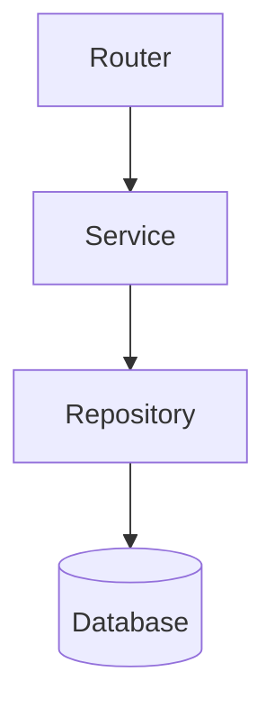

# Area Deep Dive Analysis

Generate a focused, detailed analysis report for a specific area of the codebase. This skill goes deep into one subsystem — reading actual code, tracing data flows, identifying patterns and anti-patterns, and producing actionable recommendations.

**Distinguish from other skills:**
- **Health check** = broad + shallow (project-wide metrics)
- **Project report** = external audience (stakeholders/investors)
- **Deep dive** = narrow + deep (one area, implementation-level detail)

## When to Use

- Investigating a specific feature before modifying it
- Understanding a subsystem's architecture
- Pre-refactoring analysis to map dependencies and risks
- Debugging systemic issues in one area
- Finding improvement opportunities ("what can we do better in X?")
- When the user points at part of the codebase and says "explain this" or "analyze this"

## Supported Areas

The user specifies which area to analyze. Common targets:

| Area | Scope | Discovery Method |
|------|-------|-----------------|
| `backend` | 전체 백엔드: 모델, 서비스, 리포지토리 | CLAUDE.md Backend 섹션 경로 참조 |
| `frontend` | 전체 프론트엔드: 컴포넌트, 라우팅, 상태 | CLAUDE.md Frontend 섹션 경로 참조 |
| `auth` | 인증 흐름 E2E (BE + FE) | Grep: `auth`, `login`, `JWT`, `token` |
| `database` | 모델, 마이그레이션, 쿼리, 인덱스 | Grep: ORM 패턴 (`SQLModel`, `table=True`, `Base`) |
| `api` | API 라우트, 스키마, 미들웨어 | Grep: `@router`, `APIRouter`, `@app.` |
| `{feature}` | 특정 기능 (사용자 지정) | Glob: `**/*{feature}*` |
| `infra` | Docker, CI/CD, 배포 설정 | Glob: `docker-compose.*`, `.github/`, `Dockerfile` |
| `tests` | 테스트 구조, 커버리지 갭 | Glob: `**/test_*`, `**/*.spec.*`, `**/*.test.*` |

If the user doesn't specify, ask: "어떤 영역을 분석할까요?"

## Analysis Process

### Step 0: Read CLAUDE.md

프로젝트의 CLAUDE.md를 먼저 읽어서 다음을 파악:
- 디렉토리 구조와 주요 경로
- 사용 중인 프레임워크/라이브러리
- 네이밍 컨벤션과 아키텍처 패턴
- 이 정보를 이후 단계에서 경로 탐색에 활용

### Step 1: Map the Area (use subagents for parallel exploration)

For large areas, spawn multiple Explore agents in parallel to cover different aspects simultaneously. For smaller areas, use Glob and Grep directly.

**For a feature (e.g., `{feature-name}`):**
1. CLAUDE.md에서 도메인/기능 디렉토리 구조 확인
2. `Glob: **/*{feature}*` 으로 관련 파일 전체 탐색
3. `Grep: {feature}` 으로 import/참조 추적
4. 테스트 파일: `Glob: **/test_*{feature}*`

**For a layer (e.g., `database`):**
1. CLAUDE.md에서 DB/ORM 관련 경로 확인
2. `Glob: **/model*.py`, `**/repository*.py` 등 레이어별 탐색
3. 마이그레이션 디렉토리 존재 여부 확인

### Step 2: Analyze (6 Dimensions)

Read the actual code — don't just list files. Understand the logic, trace execution paths, and note patterns.

**1. Architecture & Design**
- Directory structure and organization
- Key classes/functions and their responsibilities
- Design patterns used (repository, service layer, DDD, etc.)
- How this area fits into the larger system

**2. Data Flow**
- How data enters (API routes, events, cron, worker)
- How it's transformed (services, business logic)
- How it's persisted (repositories, models, migrations)
- How it exits (responses, SSE, files, webhooks)
- Include a concrete example: trace one real use case end-to-end

**3. Code Quality**
- Consistency with project conventions (CLAUDE.md patterns)
- Error handling (DDD exceptions vs legacy HTTPException)
- Type safety (type hints, Pydantic validation, SQLModel)
- Duplication or unnecessary complexity
- Naming consistency (variables, functions, files)

**4. Test Coverage & Quality**
- Which parts have tests and which don't
- Test quality (meaningful assertions vs. smoke tests)
- Mocking strategy (appropriate isolation vs. over-mocking)
- Edge cases covered or missing

**5. Dependencies & Coupling**
- Internal dependencies (cross-feature imports, shared services)
- External dependencies (libraries, APIs, infrastructure)
- Coupling assessment — can this area be modified independently?
- Circular dependencies or hidden coupling

**6. Risks, Debt & Improvement Opportunities**
- Known issues or workarounds (TODO/FIXME/HACK markers)
- Fragile code (complex conditionals, deep nesting, long functions)
- Missing validation or error handling gaps
- Performance concerns (N+1 queries, unbounded fetches, missing indexes)
- Opportunities for simplification or modernization

### Step 3: Generate Report

Save to `docs/plans/reports/REPORT-deep-dive-{area}-{YYYY-MM-DD}.md`:

```markdown
# Deep Dive: {Area Name}

> **Date:** {date}
> **Scope:** {description of what was analyzed}
> **Files analyzed:** {count}

---

## Overview

{2-3 sentences: what this area does and its role in the system}

## File Map

| File | Lines | Role |
|------|-------|------|
| `path/to/file.py` | {N} | {brief description} |

## Architecture

{Describe the structure, patterns, and key design decisions}

### Component Diagram



## Data Flow

{Describe how data moves through this area}

**Example: {concrete use case}**
1. {Step 1 with actual function/class names}
2. {Step 2}
3. ...

## Code Quality Assessment

| Aspect | Rating | Notes |
|--------|--------|-------|
| Structure consistency | {GREEN/YELLOW/RED} | {brief} |
| Error handling | {GREEN/YELLOW/RED} | {brief} |
| Type safety | {GREEN/YELLOW/RED} | {brief} |
| Duplication | {GREEN/YELLOW/RED} | {brief} |
| Naming consistency | {GREEN/YELLOW/RED} | {brief} |

## Test Coverage

| Component | Tested | Gaps |
|-----------|--------|------|
| {component} | {yes/partial/no} | {what's missing} |

## Dependencies

### Internal
- {module} — {relationship and coupling level}

### External
- {library} — {what it's used for, version concern if any}

## Risks & Technical Debt

1. **{Risk}** [{severity: HIGH/MEDIUM/LOW}] — {description and impact}
2. **{Risk}** [{severity}] — {description and impact}

## Recommendations

| Priority | Action | Effort | Impact | Rationale |
|----------|--------|--------|--------|-----------|
| P0 | {action} | {S/M/L} | {description} | {why this matters} |
| P1 | {action} | {S/M/L} | {description} | {why} |

---

*Generated by Claude Code on {date}*
```

## Key Principles

- **Depth over breadth**: Read the actual code. Understand the logic, not just the structure. Quote specific lines when relevant.
- **Concrete examples**: Show actual code paths. "When a user creates a roadmap, the flow is POST /roadmaps/jobs → RoadmapGenerationService.generate() → ARQ worker" is useful. Abstract descriptions are not.
- **Mermaid diagrams**: Use them for complex relationships. A diagram replaces a paragraph of explanation.
- **Actionable findings**: Every risk or issue needs a recommended action with rationale. "This function is 200 lines long" is an observation; "Extract the validation logic (lines 45-90) into a `validate_input()` method to improve testability" is actionable.
- **Respect scope**: Stay focused on the requested area. If you discover cross-cutting concerns, note them briefly and suggest a separate deep dive.
- **한국어 OK**: The report can be in Korean if the user communicates in Korean. Match the user's language.
