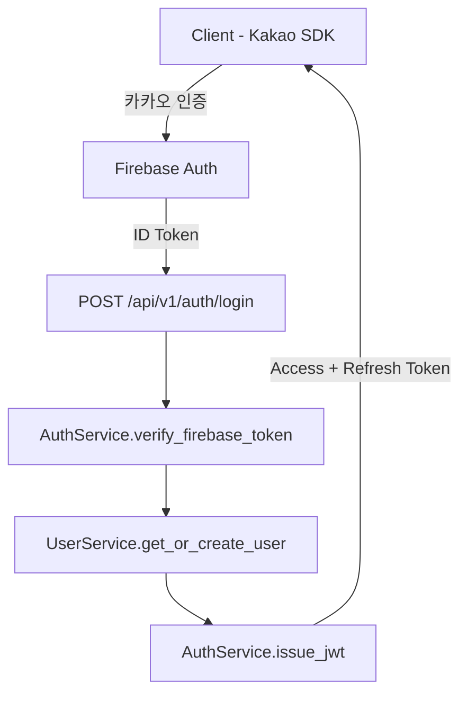

# Deep Dive: Auth (인증 시스템)

> **Date:** 2026-03-10
> **Scope:** 인증/인가 전체 흐름 (Firebase Auth, Kakao OAuth, JWT, 세션 관리)
> **Files analyzed:** 18

---

## Overview

QWarty의 인증 시스템은 Firebase Authentication을 기반으로 카카오 소셜 로그인과 이메일/비밀번호 로그인을 지원한다. 백엔드에서 Firebase ID 토큰을 검증한 뒤 자체 JWT를 발급하며, 프론트엔드는 `serverAuth.ts`를 통해 서버사이드 인증을 처리한다.

## File Map

| File | Lines | Role |
|------|-------|------|
| `backend/domain/auth/service.py` | 142 | Firebase 토큰 검증 + JWT 발급 |
| `backend/domain/auth/repository.py` | 68 | 리프레시 토큰 저장/조회 |
| `backend/domain/user/service.py` | 195 | 사용자 생성/조회 (인증 연동) |
| `backend/domain/user/model.py` | 87 | User SQLModel (firebase_uid, provider 필드) |
| `backend/api/v1/routers/auth.py` | 112 | 로그인/로그아웃/토큰 갱신 엔드포인트 |
| `backend/dtos/auth.py` | 45 | 인증 요청/응답 DTO |
| `frontend/src/lib/serverAuth.ts` | 78 | 서버사이드 JWT 검증 미들웨어 |
| `frontend/src/lib/api.ts` | 230 | API 클라이언트 (토큰 자동 첨부) |

## Architecture

Firebase Authentication이 소셜 로그인 복잡도를 흡수하고, 백엔드는 Firebase에서 발급한 ID 토큰만 검증하면 되는 구조. 자체 JWT를 별도 발급하여 Firebase 의존도를 줄이고 커스텀 클레임을 유연하게 관리한다.

## Data Flow

**Example: 카카오 로그인 -> JWT 발급**

1. 프론트엔드에서 Kakao SDK로 인증 후 Firebase `signInWithCustomToken()` 호출
2. Firebase ID 토큰 획득 -> `POST /api/v1/auth/login` 요청 (body: `{ firebase_token }`)
3. `AuthService.verify_firebase_token()` — firebase-admin SDK로 토큰 검증, uid/provider 추출
4. `UserService.get_or_create_user(firebase_uid, provider="kakao")` — DB에서 사용자 조회, 없으면 신규 생성
5. `AuthService.issue_jwt(user_id, role)` — access token (30분) + refresh token (7일) 생성
6. 응답: `{ access_token, refresh_token, user }` 반환
7. 프론트엔드 `api.ts`가 이후 요청 Authorization 헤더에 access token 자동 첨부

## Code Quality Assessment

| Aspect | Rating | Notes |
|--------|--------|-------|
| 구조 일관성 | GREEN | DDD 패턴(service/repository/model) 준수 |
| 에러 처리 | YELLOW | Firebase 토큰 만료 시 에러 메시지가 일반적 |
| 타입 안전성 | GREEN | Pydantic DTO + SQLModel 타입 힌트 완비 |
| 코드 중복 | GREEN | 토큰 검증 로직이 AuthService에 집중됨 |
| 네이밍 일관성 | YELLOW | `verify_firebase_token` vs `validate_jwt` — verify/validate 혼용 |

## Test Coverage

| Component | Tested | Gaps |
|-----------|--------|------|
| AuthService.verify_firebase_token | Yes | Firebase SDK 모킹으로 검증 |
| AuthService.issue_jwt | Yes | 만료 시간 경계값 테스트 없음 |
| Auth Router (login) | Yes | 카카오 provider 외 Apple 로그인 시나리오 미테스트 |
| Auth Router (refresh) | Partial | 만료된 refresh token 케이스만 테스트 |
| serverAuth.ts | No | 서버사이드 인증 미들웨어 테스트 부재 |

## Dependencies

### Internal
- `domain/user` — 사용자 생성/조회에 강결합 (UserService 직접 호출)
- `domain/admin` — 관리자 권한 확인 시 admin role 체크

### External
- `firebase-admin` (v6.2) — ID 토큰 검증, 서버측 Firebase 연동
- `python-jose` (v3.3) — JWT 생성/검증
- `next-intl` — 로그인 페이지 다국어 (인증 UX 관련)

## Risks & Technical Debt

1. **Firebase 장애 시 로그인 불가** [HIGH] — Firebase Auth가 SPOF. 자체 JWT로 기존 세션은 유지되지만 신규 로그인 차단됨.
2. **Refresh token rotation 미구현** [MEDIUM] — 현재 refresh token 재사용 가능. 탈취 시 만료까지 악용 위험.
3. **serverAuth.ts 테스트 부재** [MEDIUM] — 프론트엔드 서버사이드 인증 경로에 테스트 없음. 미들웨어 변경 시 사일런트 장애 가능.

## Recommendations

| Priority | Action | Effort | Impact | Rationale |
|----------|--------|--------|--------|-----------|
| P0 | Refresh token rotation 구현 | M | 보안 강화 | 토큰 탈취 시 피해 범위 제한 |
| P1 | serverAuth.ts 유닛 테스트 추가 | S | 안정성 | 인증 미들웨어는 전 페이지 영향 |
| P1 | verify/validate 네이밍 통일 | S | 가독성 | 코드베이스 일관성 향상 |
| P2 | Firebase 장애 대비 fallback 로그인 검토 | L | 가용성 | SLA 요구사항에 따라 결정 |

---

*Generated by Claude Code on 2026-03-10*
